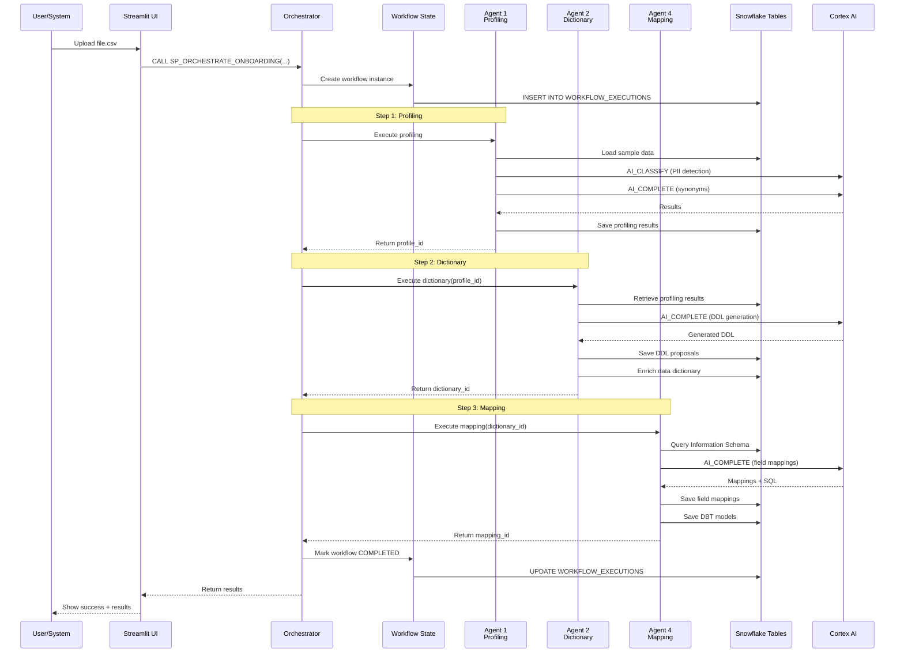
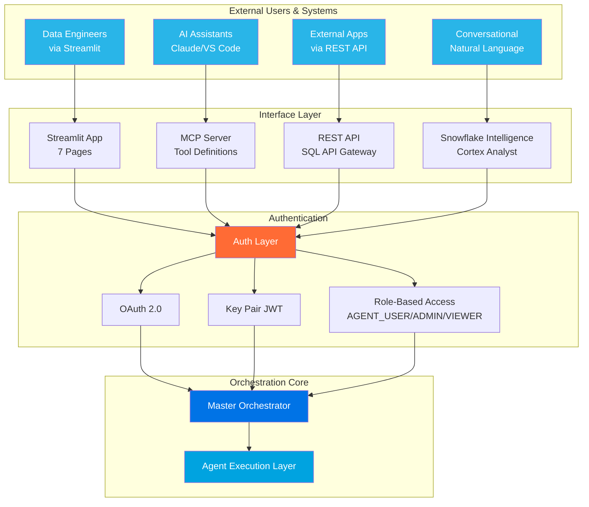
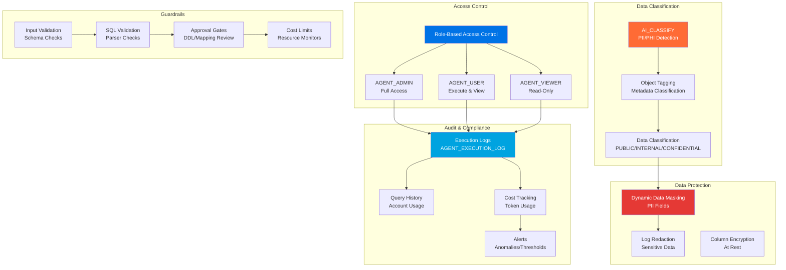
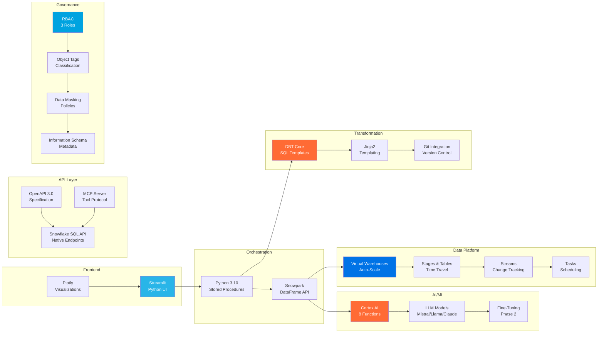

# Snowflake Agentic AI Platform - Architecture Diagrams

## 1. High-Level Layered Architecture

```mermaid
graph TB
    subgraph "Layer 5: User Experience"
        UI1[Streamlit UI<br/>7 Interactive Pages]
        UI2[AI Assistant<br/>Natural Language]
        UI3[REST API<br/>OpenAPI 3.0]
        UI4[MCP Interface<br/>External LLM Apps]
    end
    
    subgraph "Layer 4: Orchestration & Communication"
        ORCH[Master Orchestrator<br/>SP_ORCHESTRATE_ONBOARDING]
        STATE[Workflow State Machine<br/>WORKFLOW_EXECUTIONS]
        LOGS[Execution Logging<br/>AGENT_EXECUTION_LOG]
    end
    
    subgraph "Layer 3: Agent Execution"
        A1[Agent 1<br/>Data Profiling<br/>Schema + PII Detection]
        A2[Agent 2<br/>Data Dictionary<br/>DDL Generation]
        A4[Agent 4<br/>Data Mapping<br/>Transformation Logic]
    end
    
    subgraph "Layer 2: Intelligence"
        CORTEX[Snowflake Cortex AI]
        AI1[AI_COMPLETE<br/>LLM Reasoning]
        AI2[AI_CLASSIFY<br/>PII Detection]
        AI3[AI_EXTRACT<br/>Entity Extraction]
        AI4[AI_FILTER<br/>Conditions]
        AI5[AI_AGG<br/>Aggregations]
        CORTEX --> AI1
        CORTEX --> AI2
        CORTEX --> AI3
        CORTEX --> AI4
        CORTEX --> AI5
    end
    
    subgraph "Layer 1: Foundation"
        SF[Snowflake Data Platform]
        COMPUTE[Snowpark Compute<br/>3 Warehouses]
        STORAGE[Stages & Tables<br/>17 Core Tables]
        GOV[Governance<br/>RBAC + Tagging + Masking]
        SF --> COMPUTE
        SF --> STORAGE
        SF --> GOV
    end
    
    subgraph "Non-AI Features"
        INFER[INFER_SCHEMA<br/>Schema Detection]
        INFO[Information Schema<br/>Metadata Queries]
        TAG[Object Tagging<br/>Classification]
        MASK[Dynamic Masking<br/>PII Protection]
    end
    
    UI1 --> ORCH
    UI2 --> ORCH
    UI3 --> ORCH
    UI4 --> ORCH
    
    ORCH --> A1
    ORCH --> A2
    ORCH --> A4
    ORCH --> STATE
    ORCH --> LOGS
    
    A1 --> CORTEX
    A1 --> INFER
    A2 --> CORTEX
    A2 --> INFO
    A4 --> CORTEX
    A4 --> INFO
    
    A1 --> STORAGE
    A2 --> STORAGE
    A4 --> STORAGE
    
    STORAGE --> COMPUTE
    GOV --> TAG
    GOV --> MASK
    
    style UI1 fill:#29B5E8,color:#fff
    style UI2 fill:#29B5E8,color:#fff
    style UI3 fill:#29B5E8,color:#fff
    style UI4 fill:#29B5E8,color:#fff
    style ORCH fill:#00A3E0,color:#fff
    style A1 fill:#0073E6,color:#fff
    style A2 fill:#0073E6,color:#fff
    style A4 fill:#0073E6,color:#fff
    style CORTEX fill:#FF6B35,color:#fff
    style SF fill:#333,color:#fff
```



---

## 2. Data Flow Architecture

```mermaid
flowchart LR
    subgraph Input
        USER[User/System]
        FILE[Data Files<br/>CSV/JSON/Parquet]
    end
    
    subgraph "Ingestion"
        STAGE[RAW_DATA_STAGE<br/>Internal Stage]
    end
    
    subgraph "Agent 1: Profiling"
        SAMPLE[Sample Data<br/>10K rows]
        INFER[INFER_SCHEMA<br/>Auto-detect]
        STATS[Calculate Stats<br/>Nulls/Cardinality]
        PII[AI_CLASSIFY<br/>Detect PII/PHI]
        PROFILE_OUT[Profiling Results<br/>Schema + PII + Quality]
    end
    
    subgraph "Agent 2: Dictionary"
        PARSE[Parse Schema]
        DDL_GEN[AI_COMPLETE<br/>Generate DDL]
        OPTIMIZE[Optimize Types<br/>AI-powered]
        ENRICH[Enrich Dictionary<br/>Metadata Tables]
        DDL_OUT[DDL Proposals<br/>Ready for Approval]
    end
    
    subgraph "Agent 4: Mapping"
        TARGET[Query Target<br/>Information Schema]
        MAP_GEN[AI_COMPLETE<br/>Field Mappings]
        TRANS[Generate SQL<br/>Transformations]
        DBT_GEN[Create DBT Models<br/>stg/int/fct]
        MAP_OUT[Transformation Code<br/>Ready to Deploy]
    end
    
    subgraph Output
        LANDING[Landing Tables<br/>STAGING Schema]
        CURATED[Curated Tables<br/>CURATED Schema]
        DBT[DBT Project<br/>Git Repository]
    end
    
    USER -->|Upload| FILE
    FILE -->|PUT| STAGE
    
    STAGE --> SAMPLE
    SAMPLE --> INFER
    INFER --> STATS
    STATS --> PII
    PII --> PROFILE_OUT
    
    PROFILE_OUT --> PARSE
    PARSE --> DDL_GEN
    DDL_GEN --> OPTIMIZE
    OPTIMIZE --> ENRICH
    ENRICH --> DDL_OUT
    
    DDL_OUT --> TARGET
    TARGET --> MAP_GEN
    MAP_GEN --> TRANS
    TRANS --> DBT_GEN
    DBT_GEN --> MAP_OUT
    
    DDL_OUT -->|Approved| LANDING
    MAP_OUT -->|DBT Run| CURATED
    MAP_OUT --> DBT
    
    style SAMPLE fill:#E8F4F8
    style INFER fill:#C8E6C9
    style PII fill:#FF6B35,color:#fff
    style DDL_GEN fill:#FF6B35,color:#fff
    style MAP_GEN fill:#FF6B35,color:#fff
    style LANDING fill:#FFE082
    style CURATED fill:#81C784,color:#fff
```



---

## 3. Agent Workflow Orchestration



---

## 4. Multi-Interface Architecture



---

## 5. Security & Governance Architecture



---

## 6. Technology Stack Diagram



---

## 7. ASCII Art Architecture (Universal Compatibility)

```
┌─────────────────────────────────────────────────────────────────────────────┐
│                    LAYER 5: USER EXPERIENCE                                 │
│  ┌──────────────┐  ┌──────────────┐  ┌──────────────┐  ┌──────────────┐  │
│  │  Streamlit   │  │     AI       │  │  REST API    │  │     MCP      │  │
│  │     UI       │  │  Assistant   │  │  (OpenAPI)   │  │  Interface   │  │
│  │   7 Pages    │  │   NL Query   │  │   Endpoints  │  │  External    │  │
│  └──────┬───────┘  └──────┬───────┘  └──────┬───────┘  └──────┬───────┘  │
└─────────┼──────────────────┼──────────────────┼──────────────────┼──────────┘
          │                  │                  │                  │
          └──────────────────┴──────────────────┴──────────────────┘
                                     │
┌─────────────────────────────────────────────────────────────────────────────┐
│              LAYER 4: ORCHESTRATION & COMMUNICATION                         │
│                                                                              │
│  ┌───────────────────────────────────────────────────────────────────────┐ │
│  │              Master Orchestrator (SP_ORCHESTRATE_ONBOARDING)          │ │
│  │                                                                        │ │
│  │   ┌──────────────────┐    ┌──────────────────┐    ┌───────────────┐ │ │
│  │   │  Workflow State  │    │  Execution Log   │    │   Metrics     │ │ │
│  │   │     Machine      │    │    & Tracking    │    │  Collection   │ │ │
│  │   └──────────────────┘    └──────────────────┘    └───────────────┘ │ │
│  └───────────────────────────────────────────────────────────────────────┘ │
└──────────────────┬───────────────────┬───────────────────┬──────────────────┘
                   │                   │                   │
                   ▼                   ▼                   ▼
┌─────────────────────────────────────────────────────────────────────────────┐
│                   LAYER 3: AGENT EXECUTION                                  │
│                                                                              │
│  ┌─────────────────┐   ┌─────────────────┐   ┌─────────────────┐          │
│  │    AGENT 1      │   │    AGENT 2      │   │    AGENT 4      │          │
│  │  ┌───────────┐  │   │  ┌───────────┐  │   │  ┌───────────┐  │          │
│  │  │  Profiling │  │   │  │Dictionary │  │   │  │  Mapping  │  │          │
│  │  │           │  │   │  │           │  │   │  │           │  │          │
│  │  │ • Schema  │  │   │  │ • DDL Gen │  │   │  │ • Field   │  │          │
│  │  │ • PII     │──┼───┼─▶│ • Optimize│──┼───┼─▶│   Maps    │  │          │
│  │  │ • Stats   │  │   │  │ • Enrich  │  │   │  │ • Transform│  │          │
│  │  │ • Quality │  │   │  │ • Validate│  │   │  │ • DBT Gen │  │          │
│  │  └─────┬─────┘  │   │  └─────┬─────┘  │   │  └─────┬─────┘  │          │
│  └────────┼────────┘   └────────┼────────┘   └────────┼────────┘          │
│           │ AI                   │ AI                  │ AI                 │
│           ▼                      ▼                     ▼                    │
└─────────────────────────────────────────────────────────────────────────────┘
            │                      │                     │
            └──────────────────────┴─────────────────────┘
                                   │
┌─────────────────────────────────────────────────────────────────────────────┐
│                    LAYER 2: INTELLIGENCE                                    │
│                                                                              │
│  ┌───────────────────────────────────────────────────────────────────────┐ │
│  │                    Snowflake Cortex AI                                │ │
│  │                         Model Garden                                   │ │
│  │                                                                        │ │
│  │  ┌──────────┐  ┌──────────┐  ┌──────────┐  ┌──────────┐  ┌────────┐ │ │
│  │  │AI_COMPLETE│ │AI_CLASSIFY│ │AI_EXTRACT │ │AI_FILTER │ │AI_AGG  │ │ │
│  │  │LLM Reason│ │PII/PHI Det│ │Entity Ext │ │Conditions│ │Insights│ │ │
│  │  └──────────┘  └──────────┘  └──────────┘  └──────────┘  └────────┘ │ │
│  │                                                                        │ │
│  │  Models: Mistral Large, Llama 3.1, Claude 3.5, DeepSeek              │ │
│  └───────────────────────────────────────────────────────────────────────┘ │
│                                                                              │
│  Non-AI Features:                                                           │
│  • INFER_SCHEMA (Schema Detection) • Information Schema (Metadata)         │
│  • Object Tagging (Classification) • Dynamic Masking (PII Protection)      │
└─────────────────────────────────────────────────────────────────────────────┘
                                     │
┌─────────────────────────────────────────────────────────────────────────────┐
│                LAYER 1: FOUNDATIONAL PLATFORM                               │
│                                                                              │
│  ┌───────────────────────────────────────────────────────────────────────┐ │
│  │                   Snowflake Data Cloud                                │ │
│  │                                                                        │ │
│  │  ┌────────────────┐  ┌────────────────┐  ┌────────────────────────┐ │ │
│  │  │    Compute     │  │    Storage     │  │      Governance        │ │ │
│  │  │                │  │                │  │                        │ │ │
│  │  │ • 3 Warehouses │  │ • 17 Tables    │  │ • RBAC (3 roles)       │ │ │
│  │  │ • Auto-Suspend │  │ • Stages       │  │ • Object Tagging       │ │ │
│  │  │ • Auto-Scale   │  │ • Time Travel  │  │ • Data Masking         │ │ │
│  │  │ • Snowpark     │  │ • File Formats │  │ • Audit Logs           │ │ │
│  │  └────────────────┘  └────────────────┘  └────────────────────────┘ │ │
│  └───────────────────────────────────────────────────────────────────────┘ │
└─────────────────────────────────────────────────────────────────────────────┘

                      Data Flow: User → Agent 1 → Agent 2 → Agent 4
                      State Management: All in Snowflake Tables
                      Security: RBAC + PII Detection + Masking + Audit Logs
```

---

## 8. Agent Interaction Flow (Simplified)

```
FILE UPLOAD
    │
    ▼
┌─────────────────────────────────────────────────────────────────┐
│                     ORCHESTRATOR                                │
│                  (Workflow Manager)                             │
└────┬──────────────────┬──────────────────┬─────────────────────┘
     │                  │                  │
     │ 1. Profile       │ 2. Dictionary    │ 3. Mapping
     ▼                  ▼                  ▼
┌──────────┐       ┌──────────┐       ┌──────────┐
│ AGENT 1  │       │ AGENT 2  │       │ AGENT 4  │
│          │       │          │       │          │
│ Schema   │──────▶│ DDL Gen  │──────▶│ Field    │
│ PII      │ JSON  │ Metadata │ JSON  │ Mappings │
│ Stats    │       │ Enrich   │       │ DBT Code │
└────┬─────┘       └────┬─────┘       └────┬─────┘
     │                  │                  │
     ▼                  ▼                  ▼
┌──────────────────────────────────────────────────┐
│           SNOWFLAKE TABLES                       │
│                                                   │
│  • PROFILING_RESULTS  • DDL_PROPOSALS            │
│  • AGENT_HISTORY      • FIELD_MAPPINGS           │
│  • WORKFLOW_EXECUTIONS • MONITORING              │
└──────────────────────────────────────────────────┘
```

---

## 9. Deployment Architecture

```
                              DEPLOYMENT ENVIRONMENTS

┌────────────────────┐    ┌────────────────────┐    ┌────────────────────┐
│   DEV ENVIRONMENT  │    │  TEST ENVIRONMENT  │    │  PROD ENVIRONMENT  │
│                    │    │                    │    │                    │
│  • Development     │    │  • Integration     │    │  • Production      │
│  • Testing         │    │  • UAT             │    │  • Live Data       │
│  • Debugging       │    │  • Performance     │    │  • SLA Monitoring  │
│                    │    │  • Security Tests  │    │  • DR/HA           │
│  AGENTIC_PLATFORM_ │    │  AGENTIC_PLATFORM_ │    │  AGENTIC_PLATFORM_ │
│  DEV               │    │  TEST              │    │  PROD              │
│                    │    │                    │    │                    │
│  ┌──────────────┐  │    │  ┌──────────────┐  │    │  ┌──────────────┐  │
│  │  6 Schemas   │  │    │  │  6 Schemas   │  │    │  │  6 Schemas   │  │
│  │ • AGENTS     │  │    │  │ • AGENTS     │  │    │  │ • AGENTS     │  │
│  │ • METADATA   │  │    │  │ • METADATA   │  │    │  │ • METADATA   │  │
│  │ • WORKFLOWS  │  │    │  │ • WORKFLOWS  │  │    │  │ • WORKFLOWS  │  │
│  │ • STAGING    │  │    │  │ • STAGING    │  │    │  │ • STAGING    │  │
│  │ • CURATED    │  │    │  │ • CURATED    │  │    │  │ • CURATED    │  │
│  │ • MONITORING │  │    │  │ • MONITORING │  │    │  │ • MONITORING │  │
│  └──────────────┘  │    │  └──────────────┘  │    │  └──────────────┘  │
└────────────────────┘    └────────────────────┘    └────────────────────┘
         │                         │                         │
         └─────────────────────────┴─────────────────────────┘
                                   │
                    ┌──────────────▼──────────────┐
                    │   GIT REPOSITORY             │
                    │   • SQL Scripts              │
                    │   • Agent Code               │
                    │   • DBT Projects             │
                    │   • Documentation            │
                    └─────────────────────────────┘
```

---

## Legend

### Colors (in Mermaid diagrams)
- 🔵 **Blue (#29B5E8)**: User interfaces and interaction points
- 🟠 **Orange (#FF6B35)**: AI-powered components (Cortex AI)
- 🔷 **Dark Blue (#0073E6)**: Agent execution layer
- 🟢 **Green (#C8E6C9)**: Non-AI Snowflake features
- ⚫ **Black (#333)**: Foundational platform components

### Symbols
- **→** : Data flow
- **▼** : Layer connection
- **├─** : Component relationship
- **[Box]** : System component
- **{Curly}** : Process/function

---

## How to Use These Diagrams

1. **For Executive Presentations**: Use diagrams 1, 2, and 7 (high-level overview)
2. **For Technical Reviews**: Use diagrams 3, 4, and 5 (detailed workflows)
3. **For Security Audits**: Use diagram 5 (security architecture)
4. **For Developer Onboarding**: Use diagrams 2, 3, and 6 (data flow and tech stack)
5. **For Deployment Planning**: Use diagram 9 (deployment architecture)

---

## Diagram Tools

These diagrams use:
- **Mermaid.js** for interactive diagrams (supported by GitHub, GitLab, VS Code)
- **ASCII Art** for universal compatibility (view in any text editor)

To render Mermaid diagrams:
- **GitHub/GitLab**: Automatically rendered in markdown
- **VS Code**: Install "Markdown Preview Mermaid Support" extension
- **Online**: Use [mermaid.live](https://mermaid.live) editor

---

**Last Updated**: October 17, 2025  
**Version**: 1.0  
**Part of**: Snowflake Agentic AI Platform MVP Documentation

